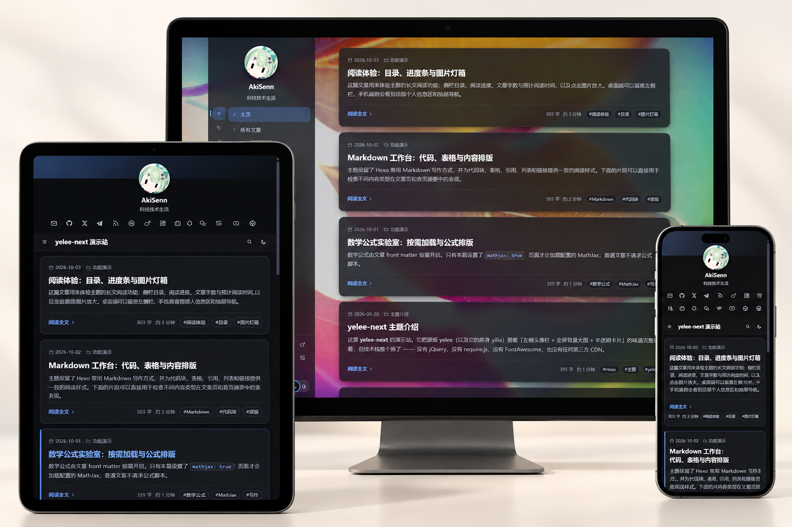

  <strong>简体中文</strong> ·
  <a href="https://github.com/AkiSenn/hexo-theme-yelee-next/blob/main/README.en.md">English</a>

  <strong>hexo-theme-yelee-next</strong> 
  <em>Yelee 主题的现代化重制版</em>

  
  
  

yelee-next 是 [hexo-theme-yelee](https://github.com/MOxFIVE/hexo-theme-yelee) 的现代化重制版，保留侧栏、全屏背景和半透明卡片等视觉特征，并采用原生 ESM 与现代 CSS。

展示图基于 [akisenn.com](https://akisenn.com/) 首页制作。

## 特性

- 无 jQuery、require.js、FontAwesome 或第三方 CDN 依赖
- 内置本地搜索、目录、阅读进度、深色模式、图片灯箱和代码复制
- 评论、统计、社交链接等按配置显示
- 支持 giscus、waline、twikoo、disqus 和 valine
- 支持简体中文、繁體中文和 English
- 提供资源指纹、缓存头生成、SEO 元数据和无障碍支持

## 安装

需要 Hexo 6 或更高版本及 hexo-renderer-ejs。将主题安装到站点的 themes/yelee-next 目录，可选择目录链接、复制或 Git 子模块：

~~~bash
node <主题目录>/tools/link.mjs /path/to/hexo-site
cp -r <主题目录> /path/to/hexo-site/themes/yelee-next
git submodule add https://github.com/AkiSenn/hexo-theme-yelee-next.git /path/to/hexo-site/themes/yelee-next
~~~

将起步配置复制到站点根目录，并设置主题：

~~~bash
cp themes/yelee-next/docs/starter-config.yml /path/to/hexo-site/_config.yelee-next.yml
~~~

~~~yaml
theme: yelee-next
~~~

构建并预览：

~~~bash
hexo clean && hexo g && hexo s
~~~

## 配置

配置优先级：站点的 _config.yelee-next.yml → 主题 _config.yml → 内置默认值。

| 文档 | 内容 |
| --- | --- |
| [主题配置](./_config.yml) | 默认配置 |
| [起步配置](./docs/starter-config.yml) | 可复制到站点使用的配置模板 |
| [迁移指南（中文）](./docs/migration.md) · [English](./docs/migration.en.md) | 从 Yelee 3.5 迁移 |
| [缓存指南（中文）](./docs/caching.md) · [English](./docs/caching.en.md) | 资源指纹与缓存配置 |
| [更新日志](./CHANGELOG.md) | 版本变更记录（中文） |

## 部署

云端构建时，站点仓库需要包含主题文件。使用同步工具更新主题副本：

~~~bash
node <主题目录>/tools/sync.mjs /path/to/hexo-site
~~~

构建产物检查：

~~~bash
node <主题目录>/tools/check.mjs /path/to/hexo-site/public
node <主题目录>/tools/seo-audit.mjs /path/to/hexo-site/public
~~~

## 致谢

本主题基于 [MOxFIVE 的 Yelee](https://github.com/MOxFIVE/hexo-theme-yelee)，其布局也承自 [Litten 的 Yilia](https://github.com/litten/hexo-theme-yilia)。由 [AkiSenn](https://github.com/AkiSenn) 维护。

## 许可

[MIT](./LICENSE) © 2026 AkiSenn
